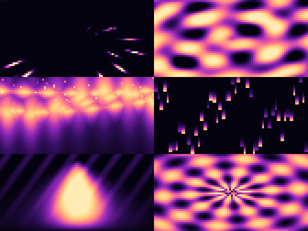

# ✨ lumina

**Zero-dependency terminal generative art.** Animated ANSI light shows that
run in any modern terminal — starfield hyperspace, plasma, aurora, matrix
rain, fire and a rotating mandala — all from pure Python and nothing else.

*Lumina* (light) is Nova Lux new-light art: gradient palettes, smoothing
gamma, and a `python3 -m lumina` that turns a blank terminal into a light
show. No Pillow, no numpy, no curses — the standard library does it all,
including the PNG encoder used for stills and gallery previews.

---

## What you get

| Effect | Alias | What it is |
|--------|-------|------------|
| `starfield` | `hyperspace`, `warp` | Stars stream outward from centre along deterministic rays — fly-toward-the-light |
| `plasma` | | Classic layered interference plasma |
| `aurora` | `northern` | Northern-lights ribbons that undulate and shimmer overhead |
| `matrix` | `rain` | Raining glyphs: bright head + decaying trail per column |
| `fire` | `flame` | Turbulent wall of flame, brightest at the base |
| `mandala` | | Rotating radial petals with ripple rings |

| Palette | Mood |
|---------|------|
| `nova` | Violet-black → magenta → solar gold (the namesake) |
| `dusk` | Nightfall blues into a hot horizon |
| `pine` | Emerald greens with teal shadows (aurora favourite) |
| `ember` | Black through ember orange to a near-white core |
| `ice` | Arctic cyan and white-blue |
| `retro` | Bold CGA-ish primaries |

## Try it

```bash
# any effect, any palette, at your terminal size
lumina --effect aurora --palette pine

# or without installing
python3 -m lumina --effect starfield --palette nova

# single still frame (great for scripting / docs)
lumina --effect plasma --palette dusk --still 1.5

# export animation frames as ANSI text
lumina --effect fire --palette ember --export ./frames --frames 24

# render real PNG stills — entirely stdlib, no Pillow
lumina --effect mandala --palette retro --png ./still --frames 8 --scale 3

# one image with every effect tiled side by side (portfolio preview)
lumina --gallery gallery.png
```

### Live controls

`1-6` pick an effect · `n` next effect · `p` pause · `+`/`-` fps · `q`/`ESC` quit.

## Gallery

All six effects, tiled by the `--gallery` command, `nova` palette:



## How it's built

- **Effects are pure functions** `value(x, y, t) -> [0, 1]`: normalised
  coordinates in, brightness out. No mutable state, no randomness at render
  time — the same `(x, y, t)` always gives the same frame.
- **Deterministic pseudo-random layout** via integer hashing, so the
  starfield and matrix look organic but stay reproducible and unit-testable.
- **Palettes** are ordered RGB anchor lists; a piecewise-linear sampler maps
  a brightness to a smooth gradient. Two sub-pixels per character cell give
  the half-block (`▀`) vertical resolution boost.

```
src/lumina/
  ansi.py      — escape-sequence builders (24-bit truecolor, blocks)
  palettes.py  — named palettes + gradient sampler
  effects.py   — the six effects + frame composer
  engine.py    — interactive loop, capture, ANSI/PNG export
  pngout.py    — minimal stdlib PNG writer (RGB + RGBA)
  gallery.py   — tile all effects into one portfolio image
  cli.py       — argparse CLI (installable as `lumina`)
tests/         — 40 unit tests across every layer incl. CLI, engine, gallery
```

## Testing

```bash
python3 -m venv .venv && . .venv/bin/activate
pip install -e . pytest
python3 -m pytest   # 40 tests
```

The suite (40 tests) genuinely asserts behaviour across every layer:

- **Palettes** — the `sample()` gradient mapper: empty and single-anchor
  inputs, out-of-range clamping, endpoint anchors, smooth-no-spike ramps.
- **Effects** — output bounds at sample points across the domain, exact
  determinism (same `x,y,t` → same value), and **real temporal periodicity**
  for the sine-based effects: plasma is asserted periodic with period
  `20π`, fire with period `4π` (derived from their t-coefficients). Gamma
  is checked to actually change the rendered frame.
- **ANSI** — truecolor escape formatting and clipping.
- **PNG** — signature, IHDR fields, CRC and a zlib round-trip on the
  stdlib-only encoder.
- **CLI / engine / gallery** — the interactive surface, which was the
  hardest layer to make honest: still frames are cleanly redirectable
  (no screen-clear/cursor churn), unknown effect/palette exit with code
  `2`, aliases resolve, and a closed output pipe (`lumina ... | head`)
  terminates **conventionally via SIGPIPE** — silently, no traceback, the
  same behaviour as other Unix tools. The non-TTY path renders a
  **bounded** number of frames and exits (no runaway stream), and both
  export paths write exactly the requested file count with correct
  dimensions.

## Install

```bash
pip install -e .          # local
# or on PyPI once published:
pip install lumina
```

## License

MIT — see [LICENSE](LICENSE). Copyright (c) 2026 Nova Lux.
